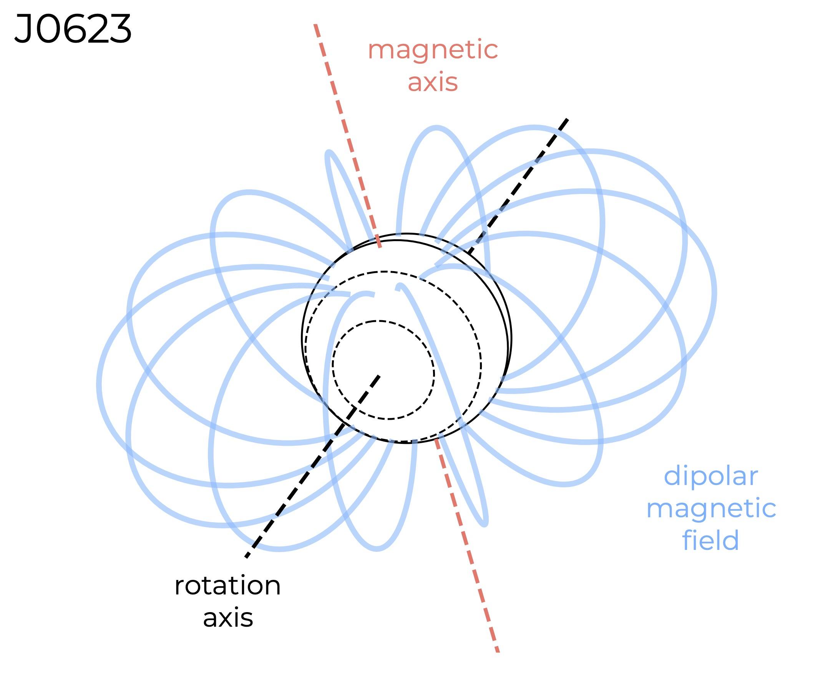

# Magnetic geometry retrieval framework

This repository contains example code ```magnetic-retrival-example.py``` for retrieving the magnetic field geometry of ultracool dwarfs (or any magnetised body) from detections of radio emission as demonstrated in [Kavanagh et al. (2024)](https://arxiv.org/abs/2410.18073). The model assumes that the emission originates from **active field lines** within a dipolar magnetic field that rotates rigidly with the object, driven by the electron cyclotron maser instability. The nested sampling algorithm [Ultranest](https://johannesbuchner.github.io/UltraNest/) is used to explore the likelihood space, which provides the posterior distributions for each model parameter.

The example code is set up to read in the file ```data.csv```, which contains columns of the rotation phase and Stokes V flux density at two different frequency bands (including their errors). Note that the frequency bands of 950-1150 MHz and 1300-1500 MHz are hard-coded in the script. A joint likelihood is computed for these two bands, although this can be modified easily for a single observing band. The code can be parallelised easily, and is scaleable for high-performance computing resources via e.g. ```mpiexec``` (note that this requires the package ```h5py```). From our testing, splitting the task over more than 32 cores results in a slow down in performance.

Here is an example of the magnetic geometry inferred for the ultracool dwarf WISE J062309.94-045624.6 (J0623):

<p align="center">
	
</p>
